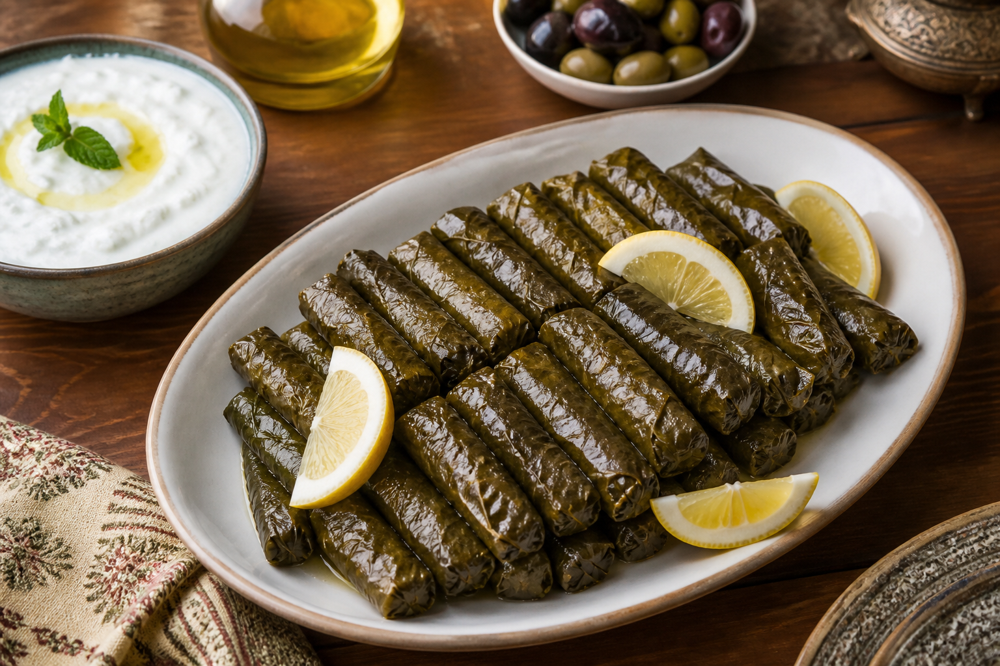
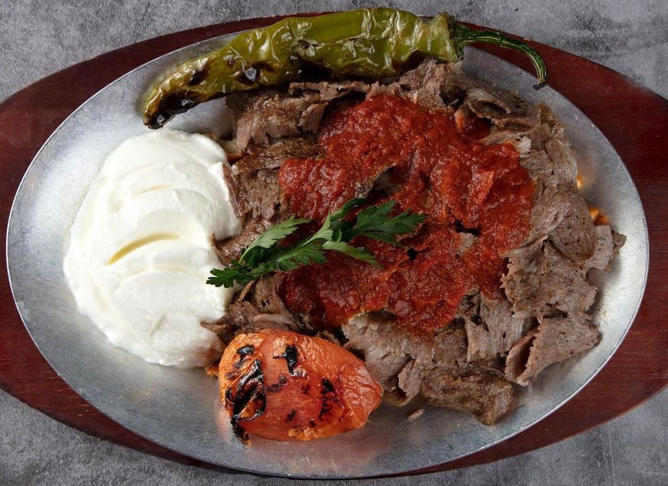

<div align="center">

# 🍽️ Tasty Recipes

### Syrian and Turkish recipes, desserts, and more—on web and mobile

Discover handpicked recipes, browse by category, save your favorites, and enjoy a multilingual experience in English, Arabic, and Turkish.


</div>

## About the Project

**Tasty Recipes** is a cross-platform recipe project consisting of a React and Vite web app and a React Native mobile app powered by Expo. It features Syrian and Turkish dishes, desserts, and appetizers, with ingredients and step-by-step preparation instructions presented through a clean, responsive interface.

## Features

- Browse recipes by cuisine or category.
- Search for recipes and view ingredients and preparation steps.
- Save favorite recipes locally.
- Full support for English, Arabic with **RTL**, and Turkish.
- Light and dark themes with persistent user preferences.
- Responsive web design and a dedicated mobile experience.
- Language, appearance, and recipe preference settings.
- Local recipe data and images—no external API is required to browse recipes.

## Recipe Preview

<table>
  <tr>
    <td align="center"><br/><b>Syrian Recipes</b></td>
    <td align="center"><br/><b>Turkish Recipes</b></td>
    <td align="center"><br/><b>Middle Eastern Desserts</b></td>
  </tr>
</table>

## Tech Stack

| Web | Mobile | Shared |
|---|---|---|
| React 19 | React Native 0.81 | JavaScript / JSX |
| Vite 8 | Expo SDK 54 | Context API |
| React Router | React Navigation | JSON recipe data |
| Bootstrap + CSS | AsyncStorage | Design tokens |

## Getting Started

### Prerequisites

- A recent [Node.js](https://nodejs.org/) version compatible with Vite 8 and Expo 54.
- npm.
- [Expo Go](https://expo.dev/go) when testing on a physical mobile device.

### Web App

```bash
git clone <repository-url>
cd tasty-recipes
npm install
npm run dev
```

Open the local URL displayed in the terminal, usually `http://localhost:5173`.

### Mobile App

Install the mobile dependencies and start Expo:

```bash
cd mobile
npm install
npm start
```

Scan the displayed QR code using Expo Go. You can also run either of the following commands from the project root:

```bash
npm run mobile:android
npm run mobile
```

> Running an iOS simulator locally requires macOS and Xcode.

## Available Scripts

| Command | Description |
|---|---|
| `npm run dev` | Start the web development server |
| `npm run build` | Create a production build in `dist/` |
| `npm run preview` | Preview the production build |
| `npm run lint` | Check the web code with Oxlint |
| `npm run mobile` | Start the Expo development server |
| `npm run mobile:android` | Run the Android app through Expo |
| `npm --prefix mobile run doctor` | Check the Expo setup and dependencies |

## Project Structure

```text
tasty-recipes/
├── public/images/          # Web recipe images
├── shared/                 # Shared colors, spacing, and typography
├── src/
│   ├── assets/data/        # Recipes and translation files
│   ├── components/         # Reusable UI components
│   ├── context/            # Language, theme, and favorites state
│   └── pages/              # Web application pages
└── mobile/
    ├── assets/images/      # Mobile recipe images
    └── src/
        ├── components/
        ├── context/
        ├── data/
        ├── screens/
        └── theme/
```

## Supported Languages

| Language | Direction | Status |
|---|---:|---:|
| English | LTR | ✅ |
| Arabic | RTL | ✅ |
| Turkish | LTR | ✅ |

## Designer & Developer

Designed and developed by **Eng. Hala Jabban**.

## Contributing

Contributions are welcome. Create a new branch, make your changes, run the code checks and production build, and then open a pull request describing your work.

```bash
git checkout -b feature/your-feature
npm run lint
npm run build
```

---

<div align="center">
  Designed and developed by <b>Eng. Hala Jabban</b><br/>
 
</div>
